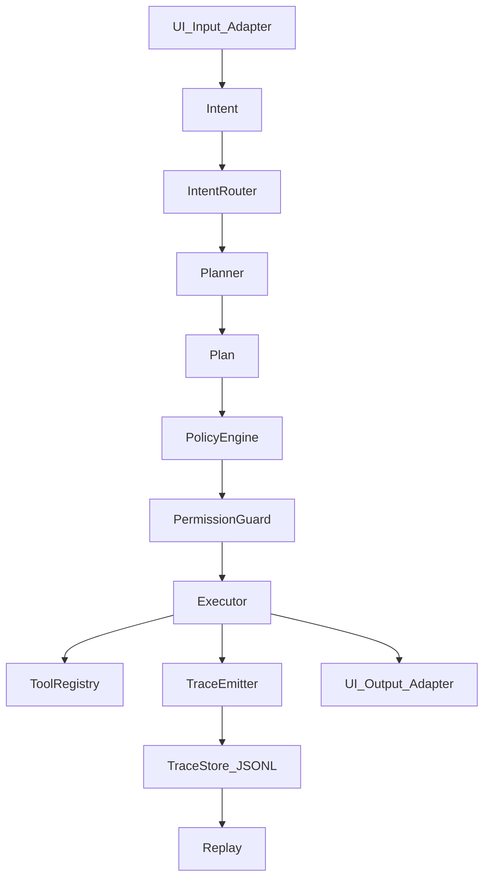

# 01 Architecture

Nucleus orchestrates a deterministic runtime:

## Components
- **UI adapters**: convert external input/output into framework contracts (`Intent`, execution summaries, trace).
- **IntentRouter**: resolves `intent_id` to a handler (usually via plugin manifest/registry).
- **Planner**: produces a `Plan` from an `Intent`. Planning is a *separate* step from execution.
- **PolicyEngine**: evaluates safety invariants and authorization rules against a `Plan`.
- **PermissionGuard**: final gate right before execution; deny-by-default for unsafe operations.
- **Executor**: runs each `Plan.step` via deterministic tools (supports dry-run).
- **TraceEmitter/Store**: emits every decision and step as `TraceEvent` and stores as JSONL.
- **Replay**: deterministic replay of traces for audit/debug.

## Determinism boundaries
- Execution is deterministic given (Plan, Tool inputs, environment constraints).
- Nucleus **must not** execute arbitrary commands generated by AI.
- Tools are the only side-effect boundary and must be explicit, registered, and validated.

